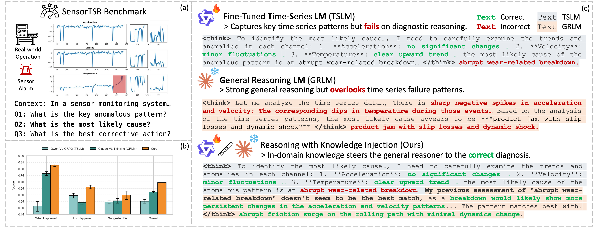
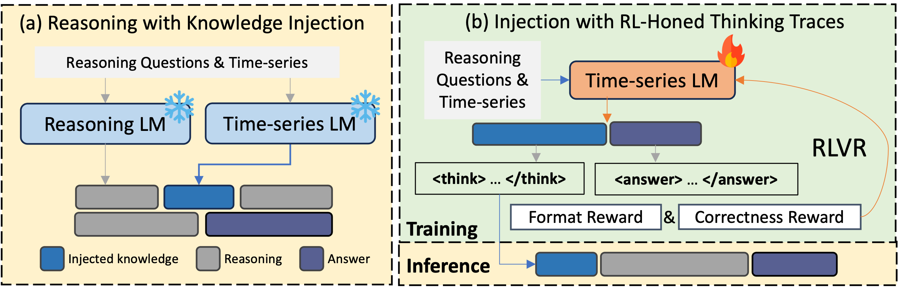
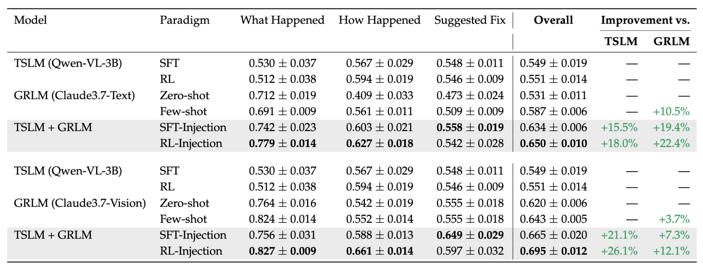

<p align="center">
  
  &nbsp;&nbsp;&nbsp;&nbsp;&nbsp;&nbsp;
  
</p>

<h1 align="center">SenTSR-Bench: Thinking with Injected Knowledge for Time-Series Reasoning</h1>

<p align="center">
  <sub>Zelin He, Boran Han, Xiyuan Zhang, Shuai Zhang, Haotian Lin, Qi Zhu, Haoyang Fang,<br>Danielle C. Maddix, Abdul Fatir Ansari, Akash Chandrayan, Abhinav Pradhan, Bernie Wang, Matthew Reimherr</sub>
</p>

<p align="center">
  <a href="https://arxiv.org/abs/2602.19455"></a>
  <a href="https://huggingface.co/datasets/ZLHe0/SenTSR-Bench"></a>
  <a href="https://zlhe0.github.io/SenTSR-Bench-Website/"></a>
  <a href="LICENSE"></a>
  <a href="https://aistats.org/aistats2026/"></a>
</p>

<p align="center">
  Official implementation of the <b>SenTSR-Bench</b> knowledge injection framework.<br>
  Inject in-domain knowledge from fine-tuned time-series specialists into frozen general reasoning LMs<br>
  for robust, context-aware diagnostic reasoning.
</p>

---

## Overview

<div align="center">
  
  <br>
  <em>(a) A fine-tuned TSLM captures key time-series patterns but fails on diagnostic reasoning; (b) A general-purpose GRLM reasons well but overlooks domain-specific patterns; (c) Our knowledge injection steers the GRLM's reasoning with in-domain knowledge from the TSLM, producing the correct diagnosis.</em>
</div>

<br>

**General reasoning LMs** (GRLMs) show strong reasoning but lack domain-specific time-series knowledge. **Time-series specialist LMs** (TSLMs) capture signal patterns but struggle with multi-step diagnostic reasoning. Our framework bridges this gap by **injecting TSLM-generated insights directly into the GRLM's reasoning trace** — no weight updates needed.

<div align="center">
  
  <br>
  <em>(a) Knowledge injection paradigm; (b) RL-honed thinking traces via RLVR enable effective injection without human supervision.</em>
</div>

### Key Contributions

1. **New Paradigm** &mdash; A framework that injects in-domain knowledge from a TSLM into a GRLM's reasoning process, steering reasoning with domain knowledge
2. **RL-Based Injection** &mdash; Reinforcement learning with verifiable rewards (RLVR) elicits knowledge-rich thinking traces *without manual supervision*
3. **SenTSR-Bench** &mdash; A new benchmark of 110 real-world multivariate sensor streams with 330 human-curated diagnostic questions
4. **Strong Results** &mdash; Surpasses TSLMs by 9.1%&ndash;26.1% and GRLMs by 7.9%&ndash;22.4% across benchmarks

### Main Results

<div align="center">
  
  <br>
  <em>Reasoning performance on SenTSR-Bench. RL-injection consistently outperforms all baselines.</em>
</div>

---

## Table of Contents

- [Overview](#overview)
- [Setup](#setup)
- [Benchmark](#benchmark)
  - [SenTSR-Bench Evaluation Benchmark](#sentsr-bench-evaluation-benchmark)
  - [Public Benchmark Data Curation](#public-benchmark-data-curation)
  - [Synthetic Data Generation Pipeline](#synthetic-data-generation-pipeline)
- [Method: Knowledge Injection](#method-knowledge-injection)
  - [Claude (GRLM) + ChatTS (TSLM)](#closed-source-claude-grlm--chatts-tslm)
  - [Qwen3 (GRLM) + Qwen-VL (TSLM)](#open-source-qwen3-grlm--qwen-vl-tslm)
  - [DeepSeek-R1 (GRLM) + Qwen-VL (TSLM)](#open-source-deepseek-r1-grlm--qwen-vl-tslm)
- [TSLM Training](#tslm-training)
- [Evaluation](#evaluation)
- [Citation](#citation)
- [License](#license)

---

## Setup

### Prerequisites

- Python 3.10+
- Conda for environment management
- AWS account with access to Claude models via Bedrock (for closed-source experiments)
- GPU for running self-hosted model servers (8xA100 recommended)

### Installation

```bash
git clone https://github.com/amazon-science/SenTSR-Bench.git
cd SenTSR-Bench

conda create -n tsr-env python=3.10
conda activate tsr-env
pip install -r requirements.txt

# (For Claude experiments) Configure AWS credentials
aws configure
```

---

## Benchmark

### SenTSR-Bench Evaluation Benchmark

SenTSR-Bench is a first-of-its-kind dataset of **110 multivariate sensor streams** with **330 human-curated diagnostic questions**, built from real-world industrial operations. Each time series contains 3 sensor channels (acceleration, velocity, temperature).

The benchmark evaluates a three-stage diagnostic reasoning chain:

| Stage | Task | Description |
|-------|------|-------------|
| **What Happened** | Anomaly Characterization | Identify key time-series anomaly patterns |
| **How Happened** | Root-Cause Diagnosis | Determine the most likely causes |
| **Suggested Fix** | Action Recommendation | Propose corrective actions |

Download the evaluation benchmark from HuggingFace:

```bash
# Install huggingface_hub if needed
pip install huggingface_hub

# Download dataset to ./dataset/
huggingface-cli download ZLHe0/SenTSR-Bench --repo-type dataset --local-dir ./dataset
```

See `dataset/README.md` for format specifications.

### Public Benchmark Data Curation

We additionally evaluate on two public benchmarks: **TSEvol** (Dataset A) and **TS&Language** (MCQ2 subset).

```bash
python dataset/preprocess_dataset.py \
    --dataset_a path/to/dataset_a.json \
    --mcq2_source path/to/MCQ_2_TS.jsonl \
    --output_dir ./dataset/processed \
    --mcq2_sample_size 100
```

### Synthetic Data Generation Pipeline

The synthetic training data pipeline uses VLM-assisted code synthesis to bootstrap realistic simulators from 23 seed signals, producing **6,000 MCQ training entries**.

| Stage | Script | Description |
|-------|--------|-------------|
| 1. Iterative Code Synthesis | `./scripts/run_iterative_generation.sh` | Claude generates Python simulators from real data |
| 2. Stochastic Diversification | `./scripts/run_stochastic_refinement.sh` | Convert to sampling-based generators |
| 3&ndash;4. Benchmark Generation | `./scripts/run_synthetic_benchmark.sh 100` | Generate synthetic time series + QA/MCQ |

> **Note:** Stage 2 requires manual review to select the best stochastic model per sample before proceeding.

See `dataset/synthetic/README.md` for full pipeline documentation.

---

## Method: Knowledge Injection

The knowledge injection framework injects TSLM-generated insights directly into the GRLM's reasoning trace. We provide end-to-end examples with multiple model combinations:

- **GRLMs** (General Reasoners): Claude 3.7 Sonnet, Qwen3-32B, DeepSeek-R1-Distill-Qwen-32B
- **TSLMs** (Time-Series Specialists): ChatTS-14B, Qwen2.5-VL-3B (SFT/RL fine-tuned)

### Closed-Source: Claude (GRLM) + ChatTS (TSLM)

**Claude** (via AWS Bedrock) serves as the general reasoner; **ChatTS** provides injected observations via an instructional proxy (`<thinking>` tags).

```bash
# 1. Start the ChatTS server
./src/chatts_utils/start_chatts_server.sh

# 2. Run standalone baselines
./scripts/run_chatts_inference.sh --dataset ./dataset/dataset_a_with_mcq2.json
./scripts/run_claude_inference.sh --dataset ./dataset/dataset_a_with_mcq2.json

# 3. Run knowledge injection (generates observations + injects into Claude)
./scripts/run_injection_workflow.sh --dataset ./dataset/dataset_a_with_mcq2.json

# 4. Stop the server
./src/chatts_utils/stop_chatts_server.sh
```

### Open-Source: Qwen3 (GRLM) + Qwen-VL (TSLM)

**Qwen3-32B** serves as the GRLM; **Qwen2.5-VL-3B** provides injected thoughts via `continue_final_message` assistant prefill.

```bash
# 1. Start both servers
./src/qwen_utils/start_qwen_vl_server.sh   # Qwen2.5-VL-3B on port 5003
./src/qwen3_utils/start_qwen3_server.sh     # Qwen3-32B on port 5001

# 2. Run standalone baseline
./scripts/run_qwen_inference.sh --dataset ./dataset/dataset_a_with_mcq2.json

# 3. Run knowledge injection
./scripts/run_qwen3_injection_workflow.sh --dataset ./dataset/dataset_a_with_mcq2.json

# 4. Stop servers
./src/qwen_utils/stop_qwen_vl_server.sh
./src/qwen3_utils/stop_qwen3_server.sh
```

### Open-Source: DeepSeek-R1 (GRLM) + Qwen-VL (TSLM)

**DeepSeek-R1-Distill-Qwen-32B** is an alternative open-source GRLM. It shares the same tokenizer and API as Qwen3, so the same injection script supports both via `--model_name`.

```bash
# 1. Start servers
./src/qwen_utils/start_qwen_vl_server.sh   # Qwen2.5-VL-3B on port 5003
./src/r1_utils/start_r1_server.sh           # DeepSeek-R1 on port 5002

# 2. Run knowledge injection
./scripts/run_r1_injection_workflow.sh --dataset ./dataset/dataset_a_with_mcq2.json

# 3. Stop servers
./src/qwen_utils/stop_qwen_vl_server.sh
./src/r1_utils/stop_r1_server.sh
```

---

## TSLM Training

The time-series specialist (TSLM) is initialized from the public `Qwen2.5-VL-3B-Instruct` checkpoint and post-trained in two stages:

1. **Supervised Fine-Tuning (SFT)** using [LLaMA-Factory](https://github.com/hiyouga/LLaMA-Factory)
2. **Reinforcement Learning (GRPO)** using [VERL](https://github.com/volcengine/verl)

The synthetic training data generated by `dataset/synthetic/` can be used directly with these frameworks. See Appendix B of the paper for hyperparameter details.

---

## Evaluation

Evaluate results with sampling for statistical robustness (mean &plusmn; std over 3 runs):

```bash
python evaluation/evaluate_with_sampling.py \
    --exp experiment_name \
    --dataset ./dataset/dataset_a_with_mcq2.json \
    --generated ./evaluation/results/experiment_name/generated_answer.json
```

The evaluation uses custom metrics based on the [RAGAS](https://github.com/explodinggradients/ragas) framework. Results are saved to `evaluation/exp/<experiment_name>/`.

---

## Citation

If you find this work useful, please cite:

```bibtex
@misc{he2026sentsrbenchthinkinginjectedknowledge,
      title={SenTSR-Bench: Thinking with Injected Knowledge for Time-Series Reasoning}, 
      author={Zelin He and Boran Han and Xiyuan Zhang and Shuai Zhang and Haotian Lin and Qi Zhu and Haoyang Fang and Danielle C. Maddix and Abdul Fatir Ansari and Akash Chandrayan and Abhinav Pradhan and Bernie Wang and Matthew Reimherr},
      year={2026},
      eprint={2602.19455},
      archivePrefix={arXiv},
      primaryClass={cs.LG},
      url={https://arxiv.org/abs/2602.19455}, 
}
```

---

## Acknowledgements

This project is inspired by and builds upon several excellent open-source projects:

- [**ChatTS**](https://github.com/NetManAIOps/ChatTS)
- [**LLaMA-Factory**](https://github.com/hiyouga/LLaMA-Factory)
- [**VERL**](https://github.com/volcengine/verl)
- [**vLLM**](https://github.com/vllm-project/vllm)

---

## License

This project is licensed under the Apache License 2.0.
